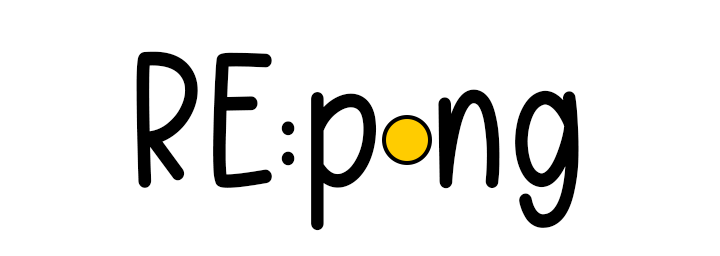
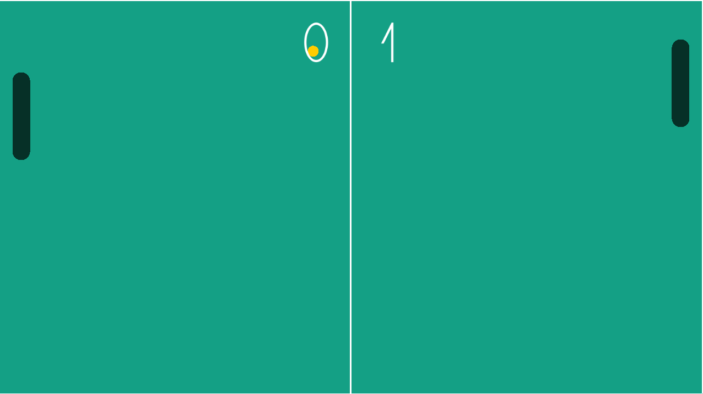
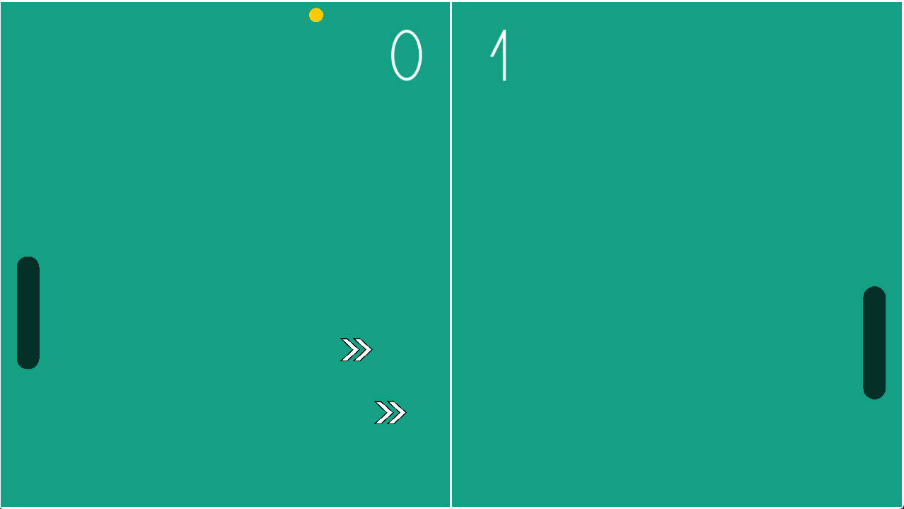
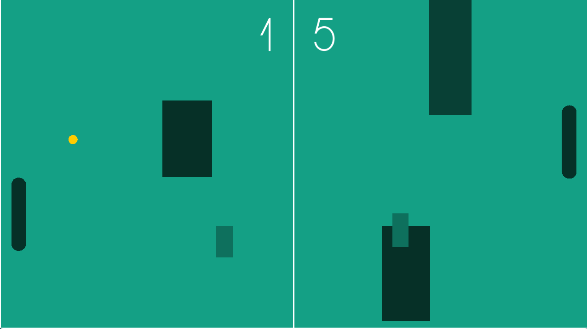

# RE:pong

## Description

A "modern" take on the old classic Pong. Every round presents a different playing field with powerups, obstacles and more. 

Made with the raylib graphics library.

## Controls

Keyboard:
 - Up Arrow/W to move up
 - Down Arrow/S to move down

## Screenshots

## Developers

 - FictionalGiggle - Designer, Programmer, Textures

## Credits

 - **Font**: [Modern Sans by Fortress Tech](https://www.dafont.com/font-comment.php?file=modern_sans)

## To Add

 - "Lights out" field where the play field is dark and only the area surrounding the ball is visible.

## Links

 - itch.io Release: [Download Here](https://fictionalgiggle.itch.io/repong)

## License

This game sources are licensed under an unmodified zlib/libpng license, which is an OSI-certified, BSD-like license that allows static linking with closed source software. Check [LICENSE](LICENSE) for further details.

*Copyright (c) 2023 FictionalGiggle ([@wchung42](https://www.github.com/wchung42))*
